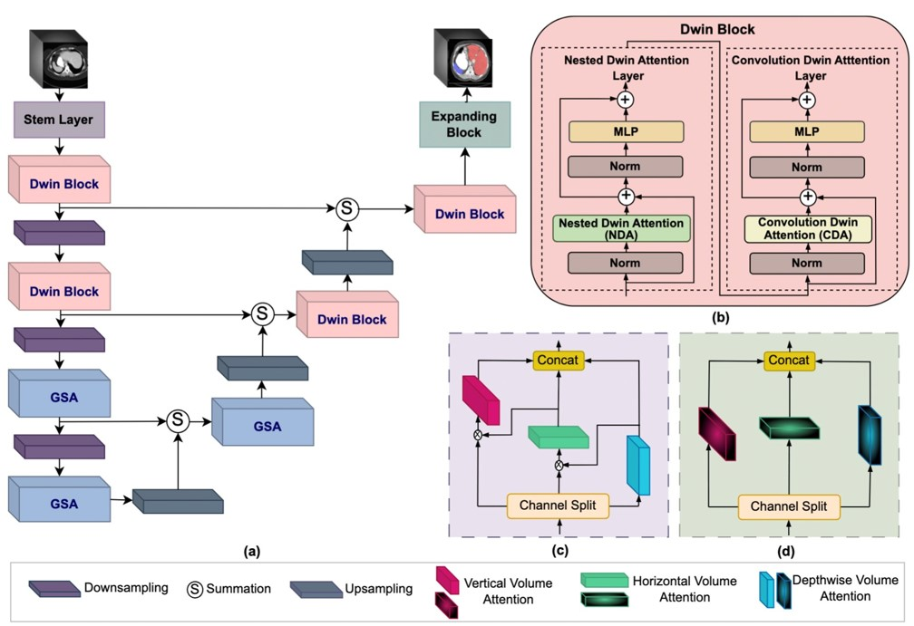
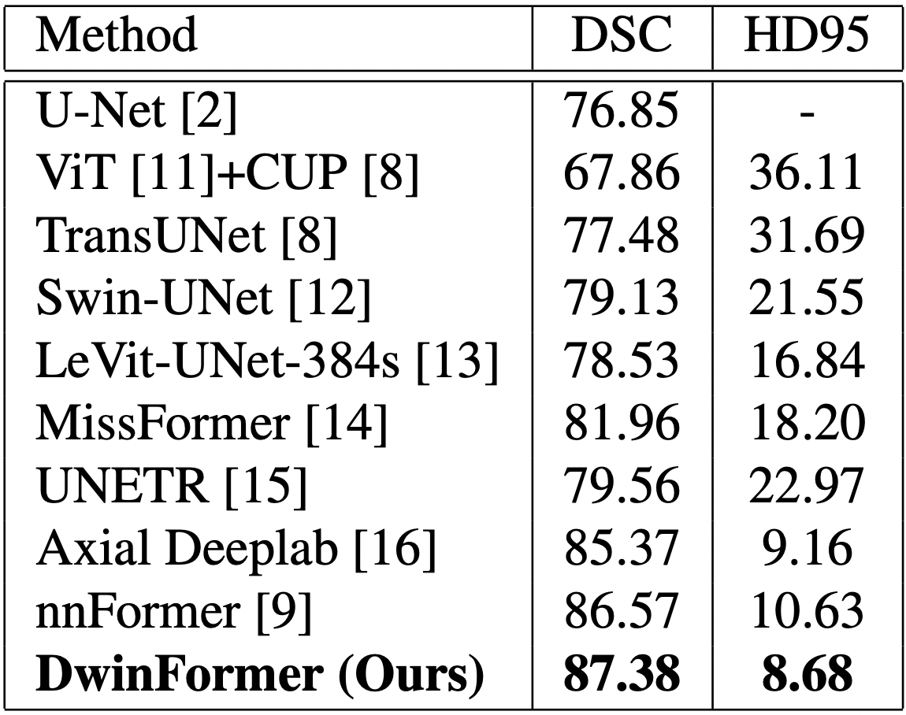
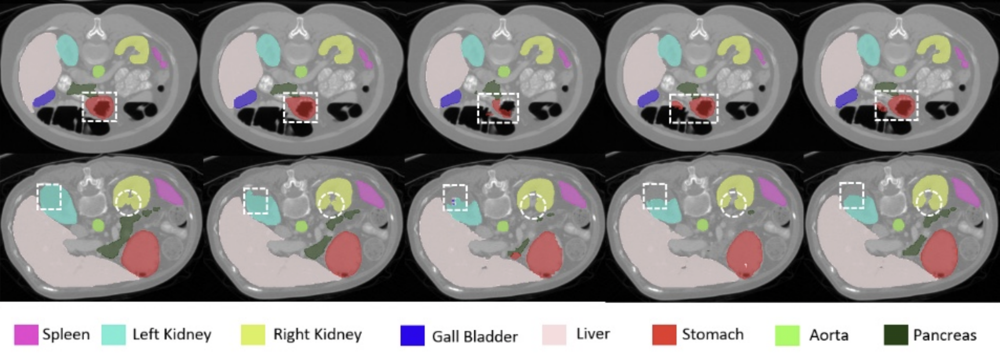

# Medical Image Segmentation Using Directional Window Attention

Daniya Najiha Abdul Kareem<sup>1</sup>, Mustansar Fiaz<sup>1</sup>, Noa Novershtern<sup>2</sup>,, Hisham Cholakkal<sup>1</sup>

Mohamed Bin Zayed University of Artificial Intelligence<sup>1</sup>, Weizmann Institute of Science<sup>2</sup>

[](https://arxiv.org/abs/2406.17471)
[](https://drive.google.com/file/d/1KmXEHuCjIsd1wcijshOtzuIWH3Lw-IP3/view?usp=drive_link)

<hr />


> **Abstract:** *Accurate segmentation of medical images is crucial for diagnostic purposes, including cell segmentation, tumor identification, and organ localization. Traditional convolutional neural network (CNN)-based approaches struggled to achieve precise segmentation results due to their limited receptive fields, particularly in cases involving multi-organ segmentation with varying shapes and sizes. The transformer-based approaches address this limitation by leveraging the global receptive field, but they often face challenges in capturing local information required for pixel-precise segmentation. In this work, we introduce DwinFormer, a hierarchical encoder-decoder architecture for medical image segmentation comprising a directional window (Dwin) attention and global self-attention (GSA) for feature encoding. The focus of our design is the introduction of Dwin block within DwinFormer that effectively captures local and global information along the horizontal, vertical, and depthwise directions of the input feature map by separately performing attention in each of these directional volumes. To this end, our Dwin block introduces a nested Dwin attention (NDA) that progressively increases the receptive field in horizontal, vertical, and depthwise directions and a convolutional Dwin attention (CDA) that captures local contextual information for the attention computation. While the proposed Dwin block captures local and global dependencies at the first two high-resolution stages of DwinFormer, the GSA block encodes global dependencies at the last two lower-resolution stages. Experiments over the challenging 3D Synapse Multi-organ dataset and Cell HMS dataset demonstrate the benefits of our DwinFormer over the state-of-the-art approaches.* 
<hr />

## Results

### Synapse Dataset
State-of-the-art comparison on the abdominal multi-organ Synapse dataset. We report both the segmentation performance (DSC, HD95).
Our proposed DwinFormer achieves favorable segmentation performance against existing methods. Best results are in bold. 

<p align="center">
  
</p>

<hr />

## Qualitative Comparison

### Synapse Dataset
Qualitative comparison on multi-organ segmentation task. Here, we compare our method with existing methods: Swin UNETR, and nnFormer. 
The different abdominal organs are shown in the legend below the examples. Existing methods struggle to correctly segment different organs (marked in red dashed box). 
Our DwinFormer achieves promising segmentation performance by accurately segmenting the organs.


<hr />

## Installation
The code is tested with PyTorch 1.11.0 and CUDA 11.3. After cloning the repository, follow the below steps for installation,

1. Create and activate conda environment
```shell
conda create --name dwinformer python=3.8
conda activate dwinformer
```
2. Install PyTorch and torchvision
```shell
pip install torch==1.11.0+cu113 torchvision==0.12.0+cu113 --extra-index-url https://download.pytorch.org/whl/cu113
```
3. Install other dependencies
```shell
pip install -r requirements.txt
```
<hr />


## Dataset
We follow the same dataset preprocessing as in [nnFormer](https://github.com/282857341/nnFormer).
The dataset folders for Synapse should be organized as follows: 

```
./DATASET_Synapse/
  ├── dwinformer_raw/
      ├── dwinformer_raw_data/
           ├── Task02_Synapse/
              ├── imagesTr/
              ├── imagesTs/
              ├── labelsTr/
              ├── labelsTs/
              ├── dataset.json
           ├── Task002_Synapse
       ├── dwinformer_cropped_data/
           ├── Task002_Synapse
 ```
 
Please refer to [Setting up the datasets](https://github.com/282857341/nnFormer) on nnFormer repository for more details.
Alternatively, you can download the preprocessed dataset for [Synapse](https://mbzuaiac-my.sharepoint.com/:u:/g/personal/abdelrahman_youssief_mbzuai_ac_ae/EbHDhSjkQW5Ak9SMPnGCyb8BOID98wdg3uUvQ0eNvTZ8RA?e=YVhfdg) and extract it under the project directory.

## Training
The following script can be used for training our DwinFormer model on the Multi-organ Synapse dataset:
```shell
bash training_scripts/run_training_synapse.sh
```

<hr />

## Evaluation

To reproduce the results of UNETR++: 

1- Download [Synapse weights](https://drive.google.com/file/d/13JuLMeDQRR_a3c3tr2V2oav6I29fJoBa) and paste ```model_final_checkpoint.model``` in the following path:
```shell
unetr_pp/evaluation/unetr_pp_synapse_checkpoint/unetr_pp/3d_fullres/Task002_Synapse/unetr_pp_trainer_synapse__unetr_pp_Plansv2.1/fold_0/
```
Then, run 
```shell
bash evaluation_scripts/run_evaluation_synapse.sh
```

## Acknowledgement
This repository is built based on [nnFormer](https://github.com/282857341/nnFormer) repository.

## Citation
If you use our work, please consider citing:
```bibtex
@INPROCEEDINGS{10635414,
  author={Kareem, Daniya Najiha A. and Fiaz, Mustansar and Novershtern, Noa and Cholakkal, Hisham},
  booktitle={2024 IEEE International Symposium on Biomedical Imaging (ISBI)}, 
  title={Medical Image Segmentation Using Directional Window Attention}, 
  year={2024},
  volume={},
  number={},
  pages={1-5},
  keywords={Image segmentation;Image coding;Three-dimensional displays;Microprocessors;Source coding;Computer architecture;Transformers},
  doi={10.1109/ISBI56570.2024.10635414}}

```

## Contact
Should you have any question, please create an issue on this repository or contact me at daniya.kareem@mbzuai.ac.ae.
